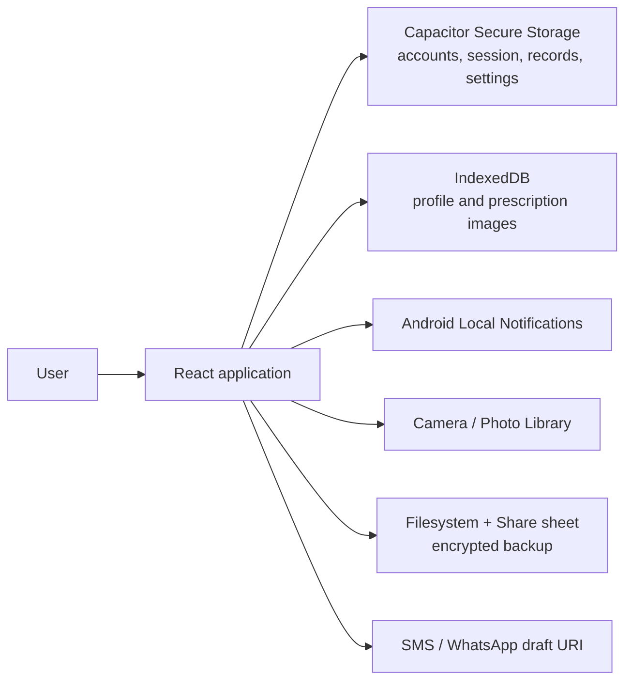

# Architecture and data

## System overview

MedLoop is a single-device application. React owns UI and domain state; Capacitor bridges the web runtime to Android services. There is no HTTP API, application server, cloud database, or background worker owned by the project.

## Runtime composition

- `src/main.jsx` mounts the React application.
- `src/App.jsx` is the state and orchestration layer: authentication, persistence, CRUD, reminders, media, backup/restore, and navigation.
- `src/components/AppShell.jsx` provides navigation and the signed-in layout.
- `src/pages/` contains lazy-loaded route-level UI.
- `src/lib/` contains domain and platform modules that are unit/integration tested independently.
- `capacitor.config.ts` maps the Vite `dist/` output into the Android application and configures local notifications.
- `android/` is the generated/customized native Android project.

Page components are code-split with `React.lazy` and `Suspense`. Navigation uses the browser History API plus the static maps in `src/navigation.js`; no routing package is used.

## Routes and access

| Path | Page | Authentication |
| --- | --- | --- |
| `/auth` | Login/sign-up | Public; signed-in users are redirected |
| `/` | Home | Required |
| `/dashboard` | Dashboard | Required |
| `/family` | Family | Required |
| `/medicines` | Medicines | Required |
| `/prescriptions` | Prescriptions | Required |
| `/alerts` | Alerts | Required |
| `/appointments` | Appointments | Required |
| `/reports` | Reports | Required |
| `/emergency-card` | Emergency Card | Required |
| `/settings` | Settings | Required |
| `/privacy` | In-app Privacy & Safety | Required in the app shell |

Static public documents are also copied into the web build: `public/privacy.html` and `public/account-deletion.html`.

## State lifecycle

1. `observeAuthState` reads the protected local session and emits the current account.
2. `App` derives a per-account key from normalized email (falling back to UID for legacy compatibility).
3. Structured state is read from Secure Storage. Legacy `localStorage` values are migrated and removed.
4. State is normalized to current defaults and historical sample records are removed.
5. React owns the live state. Changes are persisted asynchronously to Secure Storage.
6. Medicine, family, and settings changes rebuild native notification schedules.
7. Media remains in IndexedDB and is loaded into object URLs only for display.

The structured storage key is `medloop-ai-state-<normalized-email>`. Protected account and session keys are `medloop-local-accounts-v1` and `medloop-local-session-v1`; the secure-storage plugin applies the `medloop_` key prefix.

## Structured data model

The state root contains `familyMembers`, `medicines`, `prescriptions`, `appointments`, `alerts`, `doseLogs`, and `settings`.

### Family member

| Field | Meaning |
| --- | --- |
| `id` | UUID or timestamp/random fallback |
| `name` | Required display name |
| `relationship` | Defaults to `Family member` |
| `phone` | Optional E.164 SMS number |
| `whatsappNumber` | Optional E.164 WhatsApp number |
| `alertLevel` | `Level 1`, `Level 2`, or `Level 3`; only one Level 1 |
| `age` | User-entered value or `N/A` |
| `bloodGroup` | User-entered value or `Unknown` |
| `allergies` | User-entered value or `None` |

### Medicine

| Field | Meaning |
| --- | --- |
| `id`, `name`, `dosage` | Identity and directions; name required |
| `memberId` | Optional family-member reference |
| `morningTime`, `afternoonTime`, `nightTime` | Local `HH:mm` schedule values |
| `enabledDosePeriods` | Subset of `morning`, `afternoon`, `night` |
| `doseStatuses` | Period-to-`pending`/`taken`/`missed` map |
| `doseStatusesDate` | Local `YYYY-MM-DD` owning the current statuses |
| `important` | Alert severity flag retained by the model |
| `refill` | Refill state used by automatic alerts |
| `stockRemaining` | Optional non-negative whole-number stock |
| `doseUnitsPerDose` | Positive number, default 1 |
| `stockBufferDays` | Non-negative whole number, default 7 |
| `stockUnitLabel` | Up to 24 characters, default `tablets` |

### Dose log

Created only for Taken and Missed actions. Fields include record/medicine IDs, medicine name, dosage, scheduled time, dose period, optional member ID, status, local dose date, optional stock after the event, and ISO `recordedAt`. New records are prepended and limited to 200.

### Prescription, appointment, and alert

- Prescription: `id`, required `doctor`, `clinic`, and `notes`.
- Appointment: `id`, required `doctor` and `date`, plus `clinic` (defaults to `Clinic`) and `time` (defaults to `09:00`).
- Alert: `id`, `title`, `detail`, and `level`. Display combines saved alerts with derived missed-dose, refill, and stock alerts and removes duplicates.

### Settings

`displayName`, normalized `email`, `reminderLeadMinutes` (0–240), `notificationsEnabled`, `smsAlerts`, `whatsappAlerts`, and `dashboardVariant` (`halo`, `timeline`, or `companion`).

## Account model

Accounts exist only on the current installation. Email is normalized and unique on-device. Passwords are salted and derived with PBKDF2-SHA-256, 210,000 iterations, and a 256-bit output. Legacy SHA-256 password records are upgraded after a successful login. Password comparison is constant-work over equal-length strings.

The account record exposes a Firebase-like user shape to keep UI integration simple, but Firebase is not used. There is no remote identity, email verification, authorization server, or password-reset service.

## Media storage

IndexedDB database `medloop-local-media`, version 2, contains:

- `profile-photos`, keyed by `user:<uid>` (or `guest` before auth resolution);
- `prescription-images`, keyed by `<ownerUid>:<prescriptionId>`.

Supported image MIME types are JPEG, PNG, and WebP with a 10 MB limit. Structured records and media are deleted separately, so CRUD and account deletion explicitly clean both stores.

## Backup format

The outer JSON envelope has format `medloop-encrypted-backup`, version 1, creation timestamp, PBKDF2 parameters, AES-GCM IV, and Base64 ciphertext. PBKDF2-SHA-256 uses a random 16-byte salt and 310,000 iterations. AES-GCM uses a random 12-byte IV and 256-bit key.

The encrypted payload has format `medloop-local-data`, version 1, account display metadata, complete structured state, profile image, and prescription images. Binary images are Base64 encoded before encryption. Restore validates both format layers, requires user confirmation, replaces current data, and accepts files no larger than 100 MB.

## Notification architecture

Native schedules use channel `medicine-reminders-v3`, custom sound `medicine_reminder.wav`, vibration, high importance, and action types for dose state and refill drafts. Stable IDs allow routine schedules to be cancelled and rebuilt without accumulating stale notifications.

The reminder lead time wraps across midnight. A dose at `00:05` with a ten-minute lead is scheduled at `23:55`. Status state still uses the local calendar date when the user records an action.

Notification callbacks update the same React/domain functions as on-screen actions. The plugin also reports notifications received while the app is active. On non-native platforms, reminder APIs return an explanatory no-op result.

## Derived behavior

- Dashboard doses are flattened and ordered chronologically from enabled medicine periods.
- Today's statuses reset logically when `doseStatusesDate` differs from the current local date; a timer, window focus, and visibility change refresh the UI at date boundaries.
- Stock deduction occurs only on transitions into Taken. Leaving Taken restores the amount.
- Automatic alerts are derived at render time from current missed statuses, refill state, and stock threshold.
- Reports compute current-day completion and render the latest 30 retained logs.

## External boundaries

MedLoop uses Android OS services only: secure storage, notifications, camera/photo picker, filesystem cache/share sheet, and URI handling for messaging apps. No application data is intentionally transmitted to a MedLoop-controlled endpoint. A user may explicitly export/share a backup or open a message draft, at which point the chosen external app becomes a separate privacy boundary.
