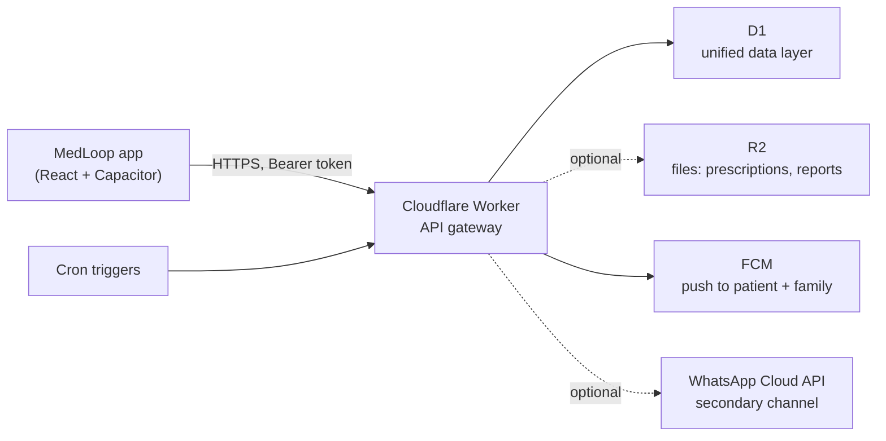

# Backend architecture (cloud tier)

MedLoop began as a single-device, local-first app (see
[ARCHITECTURE.md](ARCHITECTURE.md)). The upgrade adds a **cloud tier** on
Cloudflare so alerts can fire without the app being open and family members can
be reached across devices. The app stays local-first: the cloud is additive and
best-effort, and the device keeps working with no network.

## Platform

- **Worker = API gateway (rows #1, #2).** One entry point owns routing,
  validation, security headers, CORS, and bearer-token auth. Every request is
  authenticated except a small public set (`/health`, `/meta`,
  `/auth/register`, `/auth/link-code/redeem`).
- **D1 = the one data layer (row #24).** Medicines, stock, schedules, dose logs,
  family, alerts, notification history, emergency events, and cron-run logs live
  in a single relational store. Schema:
  [`worker/migrations/0001_initial_schema.sql`](../worker/migrations/0001_initial_schema.sql).
- **R2 = optional files (row #26).** Prescription images, reports, documents.
  The gateway auto-detects the binding and reports `files: disabled` when it is
  absent, so R2 is never a hard dependency.
- **FCM = primary alert channel (rows #15, #25).** Firebase is retained *only*
  for push messaging; it is no longer a backend or database.
- **WhatsApp = optional secondary channel (row #16).** A real Cloud API call,
  used only when a recipient opts in, to avoid recurring cost.

## Scope decision — alert-focused, not a messaging platform (row #27)

MedLoop deliberately does **not** run Kafka, Redis, WebRTC, or a full
chat/streaming stack. The domain is scheduled and event-driven **alerts**
(medicine, stock, restock, family, emergency), not real-time conversation.

| Tempting infra | Why it's omitted | What we use instead |
| --- | --- | --- |
| Kafka / event bus | Alert volume is low and bursty, not a firehose | Direct D1 writes + Cron |
| Redis | No hot shared cache or pub/sub need at this scale | D1 indexes; Worker isolate memory |
| WebRTC | No live audio/video between users | FCM push + native call intent |
| Full chat backend | MedLoop sends one-way alerts, not threads | Notification history table |

This keeps the system small, cheap, and operable by one person.

## Auth & security (foundation)

- The **device session token is the credential.** `POST /auth/register` mints a
  patient + device and returns a bearer token once. Tokens are stored only as
  SHA-256 hashes.
- All input is validated by a central `Validator` before it reaches the data
  layer; all SQL is parameterized.
- Security headers (`X-Content-Type-Options`, `Referrer-Policy`,
  `X-Frame-Options`) and an explicit CORS allow-list are applied to every
  response.
- Email is a display/recovery label, not a login key, so it is not unique and
  cannot be used to impersonate another patient. Registering twice with the same
  address creates two unrelated patients.
- **Device pairing** is therefore the only way to reach an existing account.
  `POST /auth/link-code` (authenticated) mints a 10-character, single-use code
  that expires in 10 minutes and is stored only as a SHA-256 hash; minting drops
  any earlier unused code. `POST /auth/link-code/redeem` is public — the code is
  the credential — and returns a device token for the same patient. The code
  alphabet omits `0/O` and `1/I/L` because it is typed or read aloud, and every
  redemption failure returns one identical error so a caller cannot tell an
  unknown code from a used or expired one. Redemption is not yet rate-limited;
  the ~50 bits of entropy is what currently makes guessing impractical.

## Module map

| Module | Rows | Adds to this backend |
| --- | --- | --- |
| **A · Foundation** | 1, 2, 24, 26, 27 | Worker gateway, D1 schema, R2 wiring, this doc |
| **D · Family** | 4, 5, 19 | family_members CRUD + primary emergency contact |
| **B · Medicine & stock** | 6, 7, 8, 9, 10, 11 | dose logs, stock engine, low-stock, days-left |
| **C · Alerts & notifications** | 3, 15, 16, 17, 18, 25 | alert service, FCM/WhatsApp, history |
| **E · Scheduled jobs** | 12, 13, 14 | Cron: daily check, monthly restock |
| **F · Emergency / SOS** | 20, 21, 22, 23 | SOS events, one-tap call, multi-channel |
| **G · Frontend integration** | — | `PUT /sync` upsert + `GET /sync` pull/merge + device pairing + client session/mappers/`useCloudSync` |

Build order: **A → D → B → C → E → F → G**.

## Snapshot sync (Module G)

The app stays the source of truth and owns record IDs. `PUT /sync` upserts the
local snapshot (family, medicines, prescriptions, appointments, settings, dose
logs) into D1 keyed by those IDs — idempotent, so it runs on every change.
Because IDs are client-authoritative, `medicine.member_id` references stay
aligned. Every upsert is `INSERT … ON CONFLICT(id) DO UPDATE … WHERE
patient_id = excluded.patient_id`, so an ID owned by another patient is a silent
no-op rather than a cross-tenant overwrite. On the client, `useCloudSync` is
best-effort and gated by `VITE_MEDLOOP_API_URL`: it registers a device session
on sign-in and debounces a push on state change, never blocking the local-first
UI.

### Pruning is opt-in

Deleting the rows a snapshot omits happens only when the request body carries
`prune: true`. It has to be opt-in: the client always emits arrays, so any
client holding a valid session but no local records — reinstalled, storage
cleared, or pushing before its local state hydrated — would otherwise wipe the
whole account on its first push. A client may set the flag only after it has
pulled and merged. A push without the flag also treats family IDs as the union
of the payload and the rows already stored, so a partial push cannot sever the
medicine links pointing at members it did not carry.

### Pull and merge

`GET /sync` returns the account snapshot in the same shape `PUT` accepts, so a
pulled body is directly re-pushable. On sign-in the client pulls, merges by
record ID with the **local copy winning any conflict**, adopts anything it has
never seen, and only then unlocks pruning.

**Deletes do not propagate.** A record deleted on one device is merely absent
from the snapshot, so another device treats it as unseen-and-local and pushes it
back. Propagating deletions needs tombstones — a deleted-records table plus
client-side tracking — and is not implemented.
